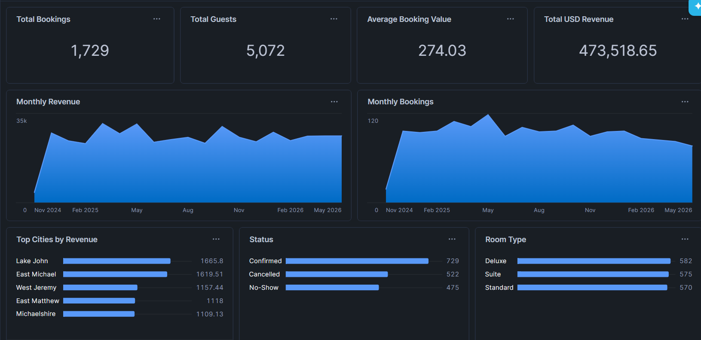

# Hotel Booking Analytics

This project is an **ELT and analytics pipeline** for hotel booking data using **Snowflake**.  
The goal is to process raw hotel bookings data, convert currencies, clean and transform it, and finally generate dashboards and KPIs for business insights.

**Special thanks to [Data with Jay](https://www.youtube.com/@Data_with_Jay) for the inspiration behind this project.**

---

## Project Scenario

Imagine you work for a hotel analytics company. You receive daily booking data in CSV format from multiple hotels around the world. The data contains:

- Booking information: customer, hotel, check-in/out dates, room type, total amount, currency, booking status.
- Exchange rates for different currencies per date.

The **business goal** is to:

1. Load the raw data into Snowflake (Bronze layer).
2. Clean and transform the data (Silver layer), handling:
3. Convert all booking amounts into USD using the exchange rates.
4. Aggregate the cleaned data into a Gold layer for reporting.
5. Build KPIs and dashboards, including:
   - Total bookings
   - Total guests
   - Total revenue
   - Average booking value
   - Revenue and bookings over time
   - Top cities by revenue
   - Bookings by status and room type

---
## Sample Dashboard

Here is a Snowflake dashboard created from the Gold layer:

## Folder Structure

- `python_scripts/` : Python script to fetch historical exchange rates (EUR, INR) and save as CSV  
- `sql/` : Full project SQL (Bronze → Silver → Gold layers) and dashboard queries  
